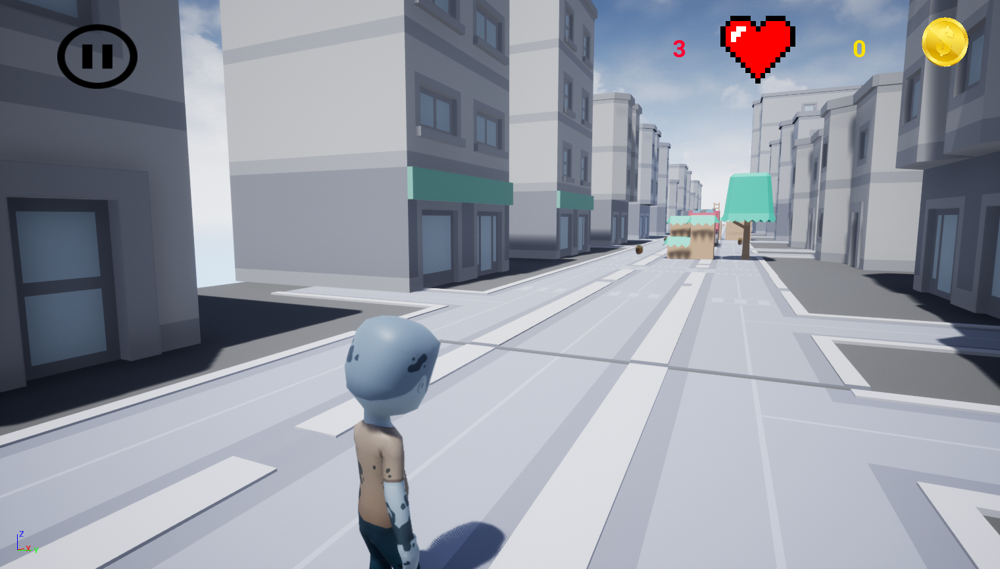
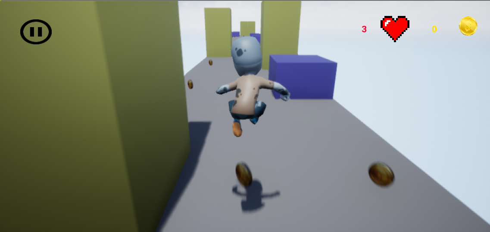

Endless Runner Game - Unreal Engine 4 (C++)

## Description

Third person endless runner built with **Unreal Engine 4** using  C++ and blueprints. Navigate through an endless terrain while dodging obstacles and collecting power-ups to achieve the highest score possible. With stunning visuals and smooth gameplay mechanics.

## Installation

### Requirements:
- [Unreal Engine 4](https://www.unrealengine.com/en-US/). You will have to sign up in Epic Games and download its launcher. From the launcher install the latest Unreal Engine version.
- [Set up Visual Studio for UE4](https://docs.unrealengine.com/4.27/en-US/ProductionPipelines/DevelopmentSetup/VisualStudioSetup/). You can download Visual Studio Community from [here](https://visualstudio.microsoft.com/es/)

### Build

1. Download and set up all the requirements
2. Git clone it
3. Right click the .uproject and select "Generate Visual studio project files".
4. Compile it

```bash
$ git clone https://github.com/llanillo/GGJ-2022-Judgment-of-lost-souls
```

## Screenshots



## Credits

[Kenney Assets](https://www.kenney.nl/assets)
